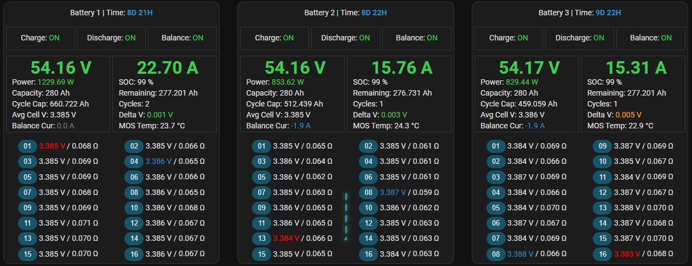
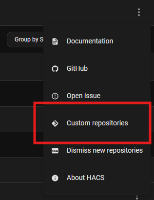
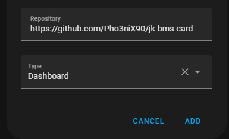
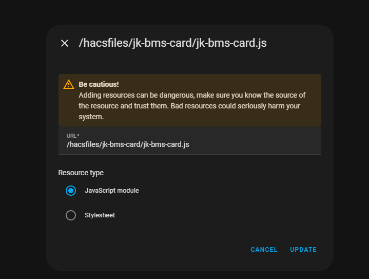

I liked the layout of [Inspiration](https://github.com/syssi/esphome-jk-bms/discussions/230), but wanted the native functionality of clicking on an entity to see the history. So I created this simplistic card



# Layouts
## Default


**Visual Logic:**
The flowline animation is exclusive to the Default Layout and triggers dynamically when the balancing current sensor reports a non-zero value. This provides a real-time visual representation of the active balancing process.

***Note on Visualization:***
*To showcase the flowline animation in the GIF above, the BMS parameters were temporarily adjusted (e.g., `balance starting voltage` at 3.380V and `balance trigger voltage` at 0.003V). These settings ensure the balancing state is active for demonstration purposes.*


## Core Reactor


inspired from: https://github.com/syssi/esphome-jk-bms/discussions/230
integration from: https://github.com/syssi/esphome-jk-bms/tree/main

## Prefix:
if your entities start with **jk_bms**_total_voltage, your prefix will be **jk_bms**

## Title action

By default, clicking the card title keeps the original behavior and opens runtime history. To open the Home Assistant device page for the BMS when the frontend exposes a device id for the runtime entity:

```yaml
type: custom:jk-bms-card
titleAction: device
```

If your Home Assistant version does not expose that metadata, set `deviceId` manually:

```yaml
type: custom:jk-bms-card
titleAction: device
deviceId: abcdef1234567890
```

## ESPHome v3 compatibility

This fork understands the legacy entity names and the newer ESPHome JK-BMS names for common renamed sensors. For example, the card will try `mosfet_temperature` before `power_tube_temperature`, `full_charge_capacity` before `total_battery_capacity_setting`, and `balancing_start_voltage` before `balance_starting_voltage`.

Cell voltage and resistance entities can be generated from prefixes instead of listing every cell manually:

```yaml
type: custom:jk-bms-card
prefix: sensor.server_room_06xu_4528dc_4528dc
cellCount: 16
entities:
  cell_prefix: sensor.server_room_06xu_4528dc_4528dc_cell_voltage_
  cell_resistance_prefix: sensor.server_room_06xu_4528dc_4528dc_cell_resistance_
```

If your cells do not follow a predictable numbering scheme, provide arrays instead:

```yaml
type: custom:jk-bms-card
cells:
  - sensor.pack_cell_a
  - sensor.pack_cell_b
  - sensor.pack_cell_c
cellResistances:
  - sensor.pack_cell_a_resistance
  - sensor.pack_cell_b_resistance
  - sensor.pack_cell_c_resistance
```

When `balancer_status_bitmask` is available, the card decodes it and highlights the exact active balancing cells in green. The animated balancing line is still an inference from the highest-voltage cell to the lowest-voltage cell while balancing current is active; the bitmask itself does not describe a cell-to-cell pair.

The Core Reactor layout includes compact balancer and heater switch controls below the SoC ring. The balancer control is shown when buttons are enabled; the heater control is shown when `hasHeater` is enabled.

## Show / Hide zones:


The control features a highly flexible interface divided into distinct functional zones. Users can toggle the visibility of specific elements — including the Title, Main Content, Cells, Cells Resistance, and other — to create a tailored viewing experience that suits their workflow.

### Hacs custom repository
1. Inside hacs, click on the top right burger menu
   
2. Add the repository url, and select dashboard as type
   

### Manual Installation

1. Create a new directory under `www` and name it `jk-bms-card` e.g `www/jk-bms-card/`.
2. Copy the `jk-bms-card.js` into the directory.
3. Add the resource to your Dashboard. You can append the filename with a `?ver=x` and increment x each time you download a new version to force a reload and avoid using a cached version. It is also a good idea to clear your browser cache.


PR's are welcomed.
